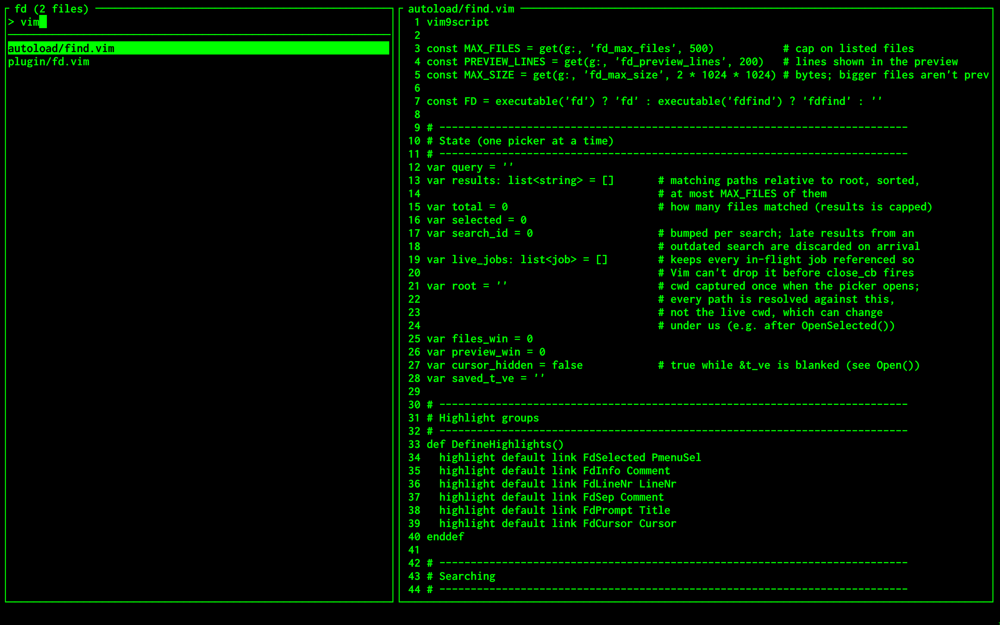

# fd.vim

A full-screen live file finder for Vim, powered by [fd](https://github.com/sharkdp/fd)



Why use fd.vim?

- **Speed** — fd runs in a background job on every keystroke, so Vim never blocks while you type. Vim9 script that compiles into bytecode, and the code is autoloaded: it costs nothing at startup until the first `:Fd`.
- **Focus** — One prompt, one list, one preview. No fuzzy scoring or ranking to second-guess: the query is a literal substring and the results are sorted by path.
- **Simplicity** — Clone the repo. No package manager, no configuration.

## Requirements

- [fd](https://github.com/sharkdp/fd)
- [Vim](https://github.com/vim/vim) 9.0+

## Install

Clone the repository:

```
git clone https://github.com/Solver42/fd.vim ~/.vim/pack/plugins/start/fd.vim
```

## Update

```
cd ~/.vim/pack/plugins/start/fd.vim && git pull
```

## Usage

- **:Fd** opens the picker in the current directory
- **:Fd {text}** opens it with an initial query
- **Type** to filter, **Backspace** or **Ctrl+H** to delete
- **Ctrl+N**, **Ctrl+J** or **Down** select next file **Ctrl+P**, **Ctrl+K** or **Up** select previous file
- **Ctrl+D** or **Ctrl+F** scroll preview down **Ctrl+B** or **Ctrl+U** scroll preview up
- **Enter** open the file
- **Esc** or **Ctrl+C** close

## How it works

The left pane lists all files that match, the right pane shows preview of the highlighted file.

The query is a literal substring, matched against the file name.

Only regular files are listed, sorted by path. Like fd itself, it skips hidden files and anything ignored by `.gitignore`, `.ignore` and `.fdignore`. Only the first 500 matches are listed, and the title shows the total.

The preview shows the first 200 lines. Binary files, files that can't be read and files over 2 MB are not read, and the preview says so instead. Paths are resolved against the directory you were in when the picker opened.

## Configuration

Pass extra flags to fd with `g:fd_args` in your `.vimrc`, for example to include hidden files but not `.git`:

```
let g:fd_args = ['--hidden', '--exclude', '.git']
```

You can change how many files are listed:

```
let g:fd_max_files = 1000
```

You can change how many lines the preview shows:

```
let g:fd_preview_lines = 100
```

You can change the size in bytes above which files are not previewed:

```
let g:fd_max_size = 1048576
```

To open the picker with a key, map it in `.vimrc`:

```
nnoremap <silent> <C-p> :Fd<CR>
```
